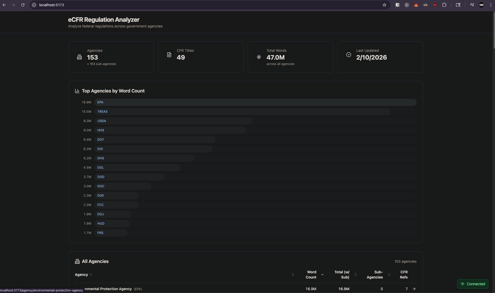
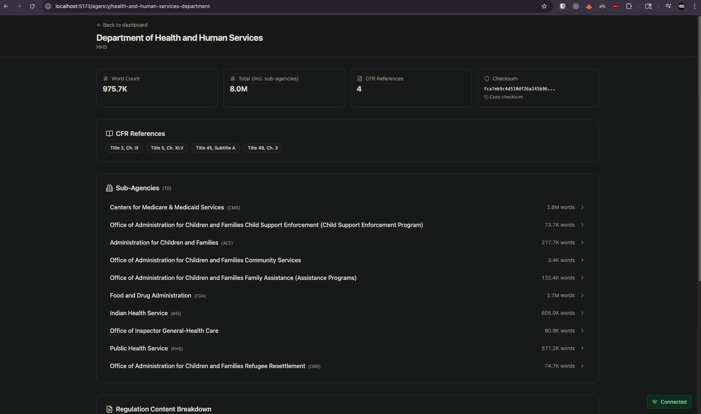
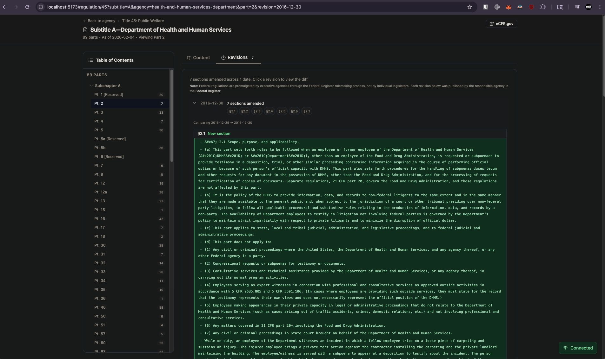
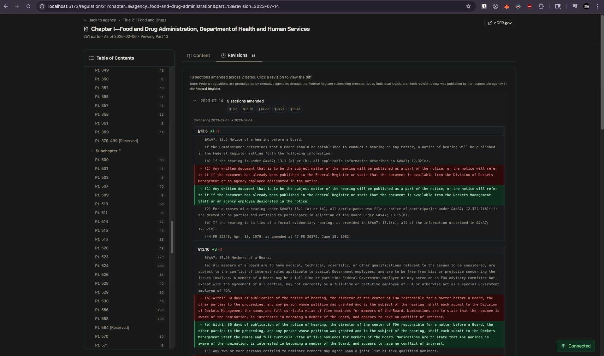
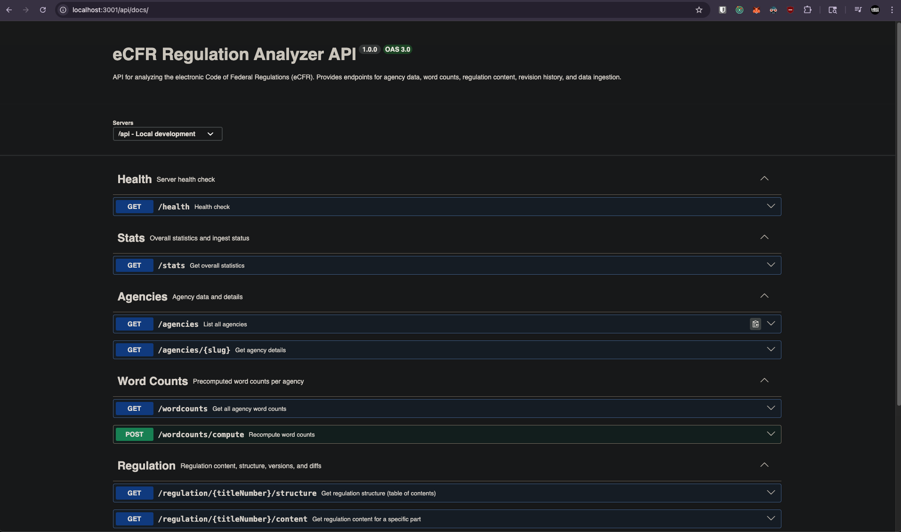

# ecfr-atlas

An open, measured atlas of the US Code of Federal Regulations.

The eCFR is 105 million words across 49 titles, 473 chapters and 9,664 parts, and it changes on
every business day. This project measures it — how much regulation exists, which agencies carry
it, where two agencies share jurisdiction over the same text, and what changed last night — and
publishes the result as a browsable site, a documented API, and a nightly open-data dump.

The one thing it will not do is make a number up.

**Live site:** _TODO: add the deployed URL once the first production deploy lands._
**API docs:** _TODO: `<site>/docs`._
**Nightly data export:** _TODO: `<r2-public-domain>/latest.sql.gz`._



---

## What it does

- **Word counts per agency**, with a status attached to every single one. A count is either
  measured, rolled up from measured children, genuinely zero because the node is reserved, or
  explicitly unavailable with a reason. There is no fourth option and no fallback.
- **Shared jurisdiction as a first-class feature.** 17 of the 487 agency↔CFR references point at
  a scope another agency also claims — 42 CFR Chapter I is run jointly by the Indian Health
  Service and the Public Health Service, for instance. The dashboard headline is the
  **deduplicated** total, which divides shared scopes among their claimants so the corpus total
  is conserved. The **attributed** total, which counts a shared scope in full for each agency, is
  stored and shown too, labelled, because it answers a different question.
- **Amendment history and diffs.** 478,050 amendment rows, and a `/diff` route that renders the
  change between two issue dates of a section.
- **A public API** with OpenAPI docs, anonymous access at a low rate limit so the docs are
  explorable immediately, and registered keys for anything more.
- **A nightly SQLite export** on public R2, with a manifest carrying per-table row counts and a
  sha256, so anyone can reproduce or contradict every figure on the site.

<table>
  <tr>
    <td></td>
    <td></td>
  </tr>
  <tr>
    <td></td>
    <td></td>
  </tr>
</table>

<sub>More screenshots: `screenshots/screen-01.png` … `screenshots/screen-13.png`.</sub>

---

## Data quality: what we publish and what we mark

This project is a rewrite. The version it replaces reported word counts it had invented: when
its regex failed to find an agency's chapter inside a title's XML, it fell back to slicing the
first `estimatedWords × 6` characters of the document and stored the resulting count in the same
integer column as a real measurement. Downstream, nothing could tell the difference.

The rewrite makes that class of bug structurally impossible rather than merely absent:

- A count and its provenance travel together as a single value
  ([`Measurement`](packages/core/src/measurement.ts)). There is no `estimate()` constructor. If a
  number cannot be measured, the only thing that can be constructed is `unavailable(reason)`.
- The database enforces it. `structure_node` carries a `CHECK` making it impossible to store a
  number without claiming to have measured it, or to claim a measurement without a number, or to
  record an unknown without a reason.
- A roll-up over children returns "unavailable" unless **every** child is known. A partial sum
  under-reports, and an under-report looks like a plausible number rather than an error.
- The UI never renders `0` for an unknown. It renders `—`, and links to a coverage figure.
- Structure is extracted with a real XML parser, never a regular expression. DIV levels in eCFR
  XML are not sequential (title 7 jumps DIV2→DIV5 thirty-five times) and title 40 contains 19,134
  untyped `<DIV>` elements inside sections. Regex extraction on this corpus is not difficult, it
  is impossible.
- Word counts exclude `HEAD`/`AUTH`/`SOURCE`/`CITA`/`CONTENTS` boilerplate, measured at 18.4% of
  1 CFR Chapter I.

Where the data is incomplete, the site says so and shows the coverage percentage next to the
total. See `/methodology` and `/data-quality` on the live site.

---

## Local development

Three commands, no network, no API keys, under 30 seconds. Contributors get a committed fixture
database rather than a 331-second download of all 49 titles.

```bash
pnpm install
pnpm db:reset     # loads fixtures/seed.sql into a local D1
pnpm dev:web      # http://localhost:4321
```

`pnpm dev:api` runs the API Worker separately. Requirements: **Node 22+** (see `.nvmrc`) and
**pnpm 10.10.0** — `corepack enable` will pick up the right version from `packageManager`.

| Command                                   | What it does                                               |
| ----------------------------------------- | ---------------------------------------------------------- |
| `pnpm typecheck`                          | `tsc --build` across the workspace, except `apps/web`      |
| `pnpm --filter @ecfr-atlas/web typecheck` | `astro check` — the site's half of the typecheck           |
| `pnpm lint`                               | ESLint flat config, type-aware                             |
| `pnpm test`                               | Vitest, including Workers-pool tests                       |
| `pnpm format`                             | Prettier write                                             |
| `pnpm build`                              | Builds packages, then the Astro site                       |
| `pnpm sync:delta`                         | Runs the nightly pipeline locally (hits the live eCFR API) |
| `pnpm db:migrate:local`                   | Applies `packages/db/migrations` to the local D1           |

---

## Architecture at a glance

```
apps/web        Astro 7 + @astrojs/cloudflare, prerender-first. ~11,100 static pages,
                deployed as Workers Static Assets.
apps/api        Hono Worker. D1 + R2 bindings, API keys, quota, OpenAPI, /diff.
packages/core   The contract: Measurement, citation/scope identity, Zod schemas for eCFR.
packages/db     The D1 schema: migrations, and the tests that prove the CHECK constraints
                reject a fabricated number. No runtime code — see packages/db/README.md.
packages/ecfr   eCFR HTTP client, XML parser, word counter.
scripts/sync    The nightly pipeline. A Node process, not a Worker.
fixtures/       Committed seed.sql so contributors need no network.
```

Two rules shape all of it:

1. **No user-facing route ever calls ecfr.gov.** Pages cite and link the official source; they
   never fetch it on the read path. `/diff` is the single exception and it memoises successful
   results to R2 permanently, so each pair of versions is fetched at most once, ever. (Failures
   are memoised with a short TTL instead — eCFR's 504s are transient and a permanent negative
   would freeze an outage into an answer.)
2. **The sync is a Node process on a GitHub Actions runner, not a Cloudflare Cron Trigger.** A
   Worker isolate gets 128 MB; title 40's XML is 156,946,999 bytes and title 26 decodes to about
   174 MB as a V8 two-byte string. The obvious-looking answer physically cannot run this job.

Full detail, including the cold-visitor request path and the nightly write path:
[`docs/ARCHITECTURE.md`](docs/ARCHITECTURE.md).

---

## How the nightly sync works

`.github/workflows/sync.yml`, `0 7 * * 1-5`. Weekdays only — eCFR publishes on business days
(57 issue dates in an observed 84-day window, none of them a weekend), so a Saturday run is
guaranteed waste.

1. Ping a Healthchecks.io dead-man's switch at `/start`.
2. Read `/api/versioner/v1/titles.json`. If `meta.import_in_progress` is true, abort — eCFR is
   mid-import and the corpus is in flux.
3. For each title whose `latest_amended_on` moved, pull the structure JSON (2.4–2.7 MB) and
   compare each node's additive byte `size` against the stored `xml_bytes`. That comparison is a
   free change fingerprint: it identifies the changed subtrees without downloading any XML.
4. Fetch only the changed parts, via `?part=` — the only query parameter that actually slices.
   `?chapter=` and `?subtitle=` validate and then return the entire title, which is precisely
   what defeated the predecessor.
5. Parse with `fast-xml-parser`, count words excluding boilerplate, write text to R2.
6. Emit and apply SQL per title, insert-then-prune: upsert with `last_seen_run_id = :run`, then
   delete `WHERE last_seen_run_id < :run` **only after** the unit succeeded. A run that dies
   leaves a superset of the truth, never a hole. A title is the unit of recovery, so a crash
   costs one title rather than the run.
7. Evaluate the publish gate. If it passes, advance the published-run pointer, rebuild the site
   from the emitted snapshot, deploy, and ping the dead-man's switch.

The pipeline holds the credentials and does its own writing; the workflow supplies secrets and
reads an exit code. `0` published, `1` the gate refused (nothing is deployed — readers keep the
last complete run), `2` failed, `75` eCFR is mid-import and today is a no-op.

The deploy build has one hard guard worth knowing about. `apps/web` falls back to the committed
fixture when no data source is configured, and the fixture's numbers are invented. Deploying a
fixture build to the real domain would publish fabricated measurements — the precise failure this
project exists to prevent — so the workflow asserts the snapshot directory exists and fails the
run if it does not, rather than silently degrading.

Throughput is capped at ≤ 8 requests/second. eCFR's limiter is a token bucket, not a concurrency
gate, so running serially does not avoid it. Two failure modes are handled differently: a
162-byte body is a bare nginx 429 with no `Retry-After` (blind exponential backoff with jitter),
and a 246-byte body is a 504 after ~50 seconds when origin XML generation timed out on a large
title (retry with a longer ceiling — it is a coin flip, not an error).

**GitHub disables scheduled workflows in public repositories after exactly 60 days without
repository activity, and the disable takes out the entire workflow file.** The Healthchecks.io
switch is the actual guarantee that the nightly is alive, because it is the only thing that can
alert on a run that never started.

Two more scheduled jobs support it:

- **`contract.yml`** fetches every eCFR endpoint and parses it against the Zod schemas in
  `packages/core`, then opens or updates a single labelled issue if the contract changed. It
  distinguishes "we got throttled" from "the shape changed" by status and content type, because a
  test that cries wolf on a 429 is a test the maintainer learns to ignore. It also asserts that
  `?part=` still slices.
- **`export.yml`** runs after a successful sync and publishes the SQLite dump.

---

## The API

Base URL: _TODO_. Interactive OpenAPI docs at `/docs`.

Anonymous requests work immediately at a low rate limit so the docs are explorable without
signing up for anything. A free registered key raises the limit.

**Getting a key:** _TODO: point at `/api-keys` once the registration flow ships._ Keys are shown
once at creation and stored only as a SHA-256 hash; we keep the last four characters so you can
tell your keys apart in a list.

Every measurement in every response carries its status. A `word_count` of `null` with
`"word_count_status": "unavailable_fetch_failed"` means we do not know — it does not mean zero,
and no endpoint will ever quietly turn one into the other.

If you want the whole dataset rather than queries against it, take the nightly export instead of
paginating the API. It is free to download and it is the same data.

---

## Contributing

See [`CONTRIBUTING.md`](CONTRIBUTING.md). The short version: local dev needs no network, the
non-negotiable rules are listed there and enforced by lint and CI, and pull requests from forks
run the full build but do not get a preview deployment (they have no secrets, by design).

Security reports: [`SECURITY.md`](SECURITY.md). Conduct: [`CODE_OF_CONDUCT.md`](CODE_OF_CONDUCT.md).

Two issue templates: a normal bug report, and **"this number looks wrong"** — a data-error
report. For a project whose entire purpose is publishing measurements, a disputed number is the
most important kind of bug there is, and it deserves its own front door.

---

## Attribution and disclaimer

Source data comes from the **electronic Code of Federal Regulations (eCFR)**, published by the
Office of the Federal Register and the Government Publishing Office, via the public
[eCFR API](https://www.ecfr.gov/developer/documentation/api/v1). As a work of the United States
government, that content is in the public domain under 17 U.S.C. § 105.

Word counts, rollups, overlap analysis and every other figure produced here are **derived
measurements** generated by this project's own parser. They are not published by, endorsed by, or
verified by any government agency, and they may contain errors. Our methodology is documented and
our data is exported nightly so that you can check us.

**This site is not an official edition of the Code of Federal Regulations.** It is not affiliated
with, endorsed by, or connected to the Office of the Federal Register, the Government Publishing
Office, the National Archives and Records Administration, or any United States government agency.
For official regulatory text, and for anything with legal consequences, consult
<https://www.ecfr.gov>.

Source code is MIT licensed. See [`LICENSE`](LICENSE), which also carries the content notice
above.
