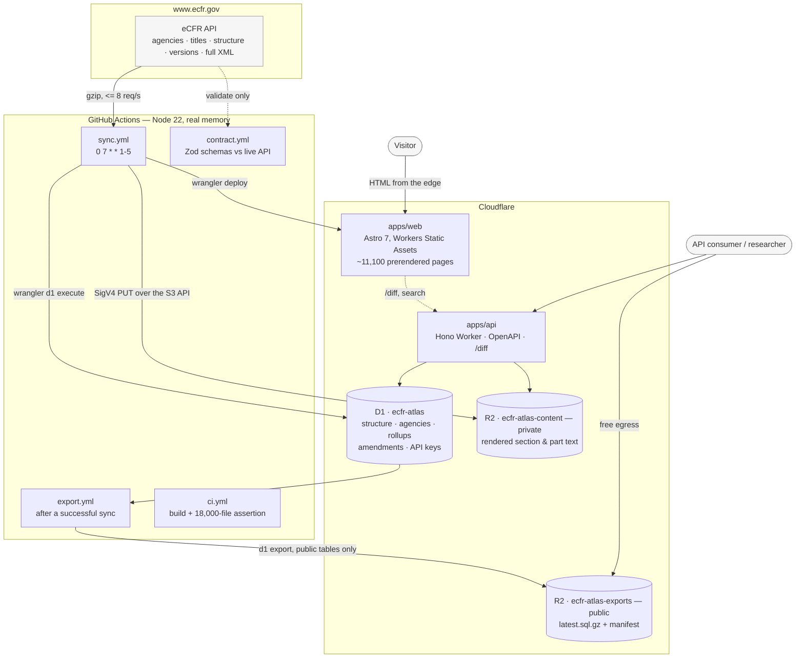
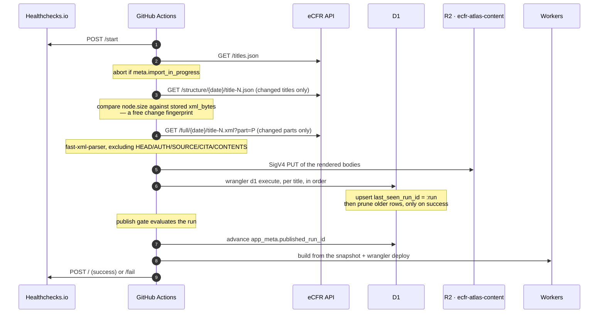

# Architecture

Every structural decision here traces to a measured constraint. Where one does, the number is
given, because the alternative — "it seemed cleaner" — is how the predecessor ended up publishing
invented word counts.

Three constraints do most of the shaping:

| Constraint                          | Measured value     | Consequence                         |
| ----------------------------------- | ------------------ | ----------------------------------- |
| Worker isolate memory               | 128 MB per isolate | The sync cannot run in a Worker     |
| D1 row size                         | 2,000,000 bytes    | Regulation text cannot live in D1   |
| Static-asset file count (free plan) | 20,000 files       | Pages are per-part, not per-section |

---

## The system

---

## The read path: a cold visitor

Someone searches for "EPA regulations word count" and lands on `/agency/environmental-protection-agency`.

1. Cloudflare's edge serves a **prerendered HTML file** from Workers Static Assets. No Worker
   invocation, no database query, no origin. The page was built by the last nightly deploy.
2. The page already contains the agency's deduplicated total, its attributed total, coverage
   percentage, its CFR references, and the shared-jurisdiction scopes it participates in.
3. Interactive pieces — `/diff`, search, and the JSON API — hit `apps/api`, a separate Hono
   Worker with D1 and R2 bindings.

**No user-facing route ever calls ecfr.gov.** Pages cite it and link to it; none fetch it. A page
that depends on a third party's rate limiter is a page that is down when the limiter says so, and
eCFR's is a token bucket that starts refusing at around 10 req/s.

`/diff` is the single exception, and it is bounded: it may fetch two versions of a section, but it
memoises the result to R2. A **successful** diff is memoised permanently — it is a pure function of
(title, section, from, to), so any given pair of issue dates is fetched at most once in the
lifetime of the project, and the memo is superseded only by bumping `DIFF_R2_PREFIX`. A **failed**
one is memoised with a TTL (`DIFF_NEGATIVE_TTL_SECONDS`), because eCFR's 504s are a coin flip on
large titles and a permanent negative would freeze a transient outage into a permanent answer.
The route is also why the site is not purely static.

### Why pages are per-part, and where the ceiling is

The build emits roughly 11,100 pages: the dashboard, 316 agencies, 50 titles, 473 chapters, 9,664
parts, plus subpart splits for the 94 parts over 1 MB. Fifty, not forty-nine — title 35 is
reserved and still gets its own page, where it renders a genuine zero (`reserved_empty` is a
_known_ status: the CFR really does have nothing there) rather than being quietly omitted.

`@astrojs/cloudflare` splits its output into `dist/client` and `dist/server`, and with every route
prerendered the latter comes out empty — verified against a real build. `dist/client` is the tree
that gets uploaded, so it is what `apps/web/wrangler.jsonc` points `assets.directory` at and what
every asset-budget invocation measures. Measuring `dist/` instead counts the wrong tree.

Cloudflare's free plan caps a Workers Static Assets deployment at **20,000 files**, and CI fails
the build at **18,000** (`scripts/ci/check-asset-count.mjs`). The headroom is thinner than it
looks: there are 227,558 sections in the corpus and **title 40 alone has 24,614**, so a change
that emits one page per section rather than per part blows the cap by an order of magnitude in a
single commit. The gate exists because that mistake is one refactor away and it fails at deploy
time, after the nightly has already written to D1 and R2.

There is also a **25 MiB per-file** cap. 26 CFR Part 1 is 69,598,633 bytes, which is why it — and
the 35 other parts over 2 MB — are split by subpart rather than rendered whole.

---

## The write path: the nightly sync

A title is the unit of both work and recovery: its SQL is applied and its checkpoint written
before the next title starts, so a crash costs one title rather than the run. The pipeline holds
the credentials and does its own writing — `scripts/sync/lib/d1.ts` shells out to
`wrangler d1 execute` with an argv array and no shell, and `scripts/sync/lib/r2.ts` signs its own
SigV4 requests. The workflow supplies secrets and reads an exit code; it does not apply SQL or
upload objects itself.

Those exit codes are the whole control flow of `sync.yml`:

| Code | Meaning                                     | What the workflow does                     |
| ---- | ------------------------------------------- | ------------------------------------------ |
| 0    | Synced, publish gate advanced               | Build the site and deploy                  |
| 1    | Synced, but the gate **refused** to publish | Deploy nothing; fail the run so it is seen |
| 2    | The run failed                              | Deploy nothing; fail                       |
| 75   | eCFR reported `import_in_progress`          | Exit cleanly — a no-op day, not an error   |

A gate refusal is the system working. Readers keep the last complete run, and someone has to
look at which quality check tripped before anything reaches production.

### Why it runs in GitHub Actions and not a Cloudflare Worker

A Cron Trigger is the obvious answer and it physically cannot do this job.

A Worker gets **128 MB per isolate**. Title 40's XML is **156,946,999 bytes**. Title 26 decodes to
roughly **174 MB** as a V8 two-byte string, because it contains 50,914 characters above U+00FF and
V8 widens the whole string to UTF-16 for any one of them. Either title exceeds the isolate limit
before any parsing begins. Streaming does not rescue this: word counting needs the element tree,
and the tree of a 157 MB document does not fit either.

A GitHub-hosted runner has 16 GB and no wall-clock limit short of six hours. The full serial
gzipped pull of all 49 titles takes 331 seconds at 49/49 HTTP 200 — the whole corpus, comfortably,
in a job that could run twenty times over before timing out.

The cost is that Actions is now a dependency, and Actions has a failure mode that Cron Triggers do
not: **GitHub disables scheduled workflows in public repositories after exactly 60 days with no
repository activity, and the disable takes out the entire workflow file**, `workflow_dispatch`
included. The mitigation is the Healthchecks.io dead-man's switch, which is the only mechanism in
the system that can alert on a run that never _started_. GitHub can only report runs that ran and
failed.

### Change detection is free

Each title's structure JSON is 2.4–2.7 MB and every node carries an additive byte `size`.
Comparing that against the stored `xml_bytes` identifies exactly which subtrees changed **without
downloading any XML**. Given a median of 48 changed sections per issue date, the nightly typically
fetches a handful of parts rather than 810 MB.

That `size` correlates with measured word counts at r = 0.99936. It is used **only** to detect
change and is never published as a word count — 0.99936 is excellent for "did this move?" and
worthless for "how many words is this?", and conflating the two is the original sin this codebase
was written to avoid.

### The fixture-fallback guard

`apps/web/src/data/load.ts` resolves its data source in a fixed order: an explicit
`ECFR_USE_FIXTURE=1`, then the JSON snapshot the sync emits, then a local D1 file, then the
committed fixture. The fixture exists so a contributor with no credentials still gets a working
site to look at, and every page of a fixture build carries a banner saying its figures are
invented.

That fallback is a hazard on the deploy path and only there. A nightly whose snapshot step
silently produced nothing would build cleanly from the fixture and publish fabricated
measurements under the real domain — the exact failure this project was rewritten to eliminate,
reintroduced through the back door of a sensible default.

So `sync.yml` asserts the snapshot directory exists before it builds, and fails the run if it
does not. CI, by contrast, sets `ECFR_USE_FIXTURE=1` explicitly: a pull-request build has no
snapshot and never should, and saying so out loud stops the result depending on whatever happens
to be on the runner's disk.

**Three components have to agree on one directory**, and their defaults do not. The writer is
`scripts/sync/lib/snapshot.ts`, whose target comes from `config.snapshotDir` — defaulting to
`.sync-cache/snapshot`. The guard above and the Astro build both read `sync-output/snapshot`. So
`sync.yml` sets `ECFR_SNAPSHOT_DIR` explicitly on the delta step. Leaving it unset does not just
fail: `.sync-cache` is the directory `actions/cache` restores at the start of every run, so a
stale snapshot from a previous night could satisfy a guard whose whole job is to prove the current
run produced one.

### Being a good citizen of someone else's API

- Sustained **≤ 8 requests/second**. The limiter is a token bucket, not a concurrency gate, so
  running serially does not avoid it; ~10 req/s is the observed onset.
- Always request gzip: the corpus is 810,419,929 B raw and 163,275,960 B gzipped (4.96×).
- Always send a descriptive User-Agent with a **contactable** URL. `packages/ecfr` composes it as
  `ecfr-atlas/0.1 (+$ECFR_CONTACT_URL)`, defaulting to this repository when the variable is unset;
  a value that is not an absolute `http(s)` URL, or that contains whitespace, a control character
  or `( ) \ "`, is refused with a warning rather than sent, because a header value carrying CR/LF
  is a second request header. `sync.yml` sets `ECFR_USER_AGENT` explicitly, which overrides the
  composed default outright. Set `ECFR_CONTACT_URL` if you fork this: an unreachable contact URL
  is worth exactly as much as no contact URL, and eCFR rate-limits harder without one.
- **Never scrape ecfr.gov HTML.** Automated clients get 302'd to a CAPTCHA.
- Two failure modes, handled differently. A **162-byte body** is a bare nginx **429** with no
  `Retry-After`, returned in ~0.13 s → blind exponential backoff with jitter. A **246-byte body**
  is a **504** at ~50 s, meaning origin XML generation timed out on a large title → retry with a
  longer ceiling. Isolated sequential title-49 fetches failed 2 of 4 times; it is a coin flip, not
  an error.

### Why only `?part=` appears in fetch URLs

eCFR's `?chapter=` and `?subtitle=` query parameters **validate but do not slice**. A request with
`?chapter=I` returns HTTP 200 and the _entire title_. Only `?part=` and `?section=` actually
narrow the response.

This is the root cause of the predecessor's invented numbers: its regex could not find the chapter
inside the full-title XML it had unknowingly received, so it fell back to
`fullText.substring(0, estimatedWords * 6)` and stored the resulting count as a measurement. Every
extraction path here resolves a chapter or subtitle down to its constituent parts and fetches
those. `contract.yml` asserts nightly that `?part=` still slices, because if that ever stopped
being true the whole strategy would fail silently.

### The upstream contract is not what you would guess

Two eCFR behaviours are encoded in `packages/core/src/ecfr-schemas.ts` because guessing wrong
about either produces a wrong number rather than an error:

- **`/versions` serialises its `meta` numbers as strings** — `"total_pages": "19"`, not `19`, and
  likewise `page`, `per_page` and `result_count`. Declaring them as `z.number()` fails validation
  on every title with more than one page of versions, which is every large title. A `NumericString`
  coercion contains the string-ness in the schema so callers get a real number. There is no
  `meta.total_count`; the field is `result_count`.
- **A filtered `/versions` response omits `meta.total_pages` entirely.** A truncated page of
  exactly 1,000 rows is byte-for-byte indistinguishable from a complete one, so the client reports
  a `versions_truncated` warning on that exact shape rather than assuming completeness.
  Under-reporting amendments is the quiet kind of wrong.

`contract.yml` validates both against the live API every weekday morning, 40 minutes ahead of the
sync, so a breaking change is a filed issue before the writer runs rather than after.

### Insert-then-prune

Every mutable table carries `last_seen_run_id`. Each unit of work upserts its rows with
`last_seen_run_id = :run`, and only after the unit succeeds does it
`DELETE WHERE last_seen_run_id < :run`.

A run that dies part-way therefore leaves a **superset** of the truth — some stale rows — rather
than a hole. Stale is visibly stale; a hole looks like a real absence. And because
`app_meta.published_run_id` only advances at the end, readers keep serving the last complete run
until a new one finishes. A failed sync degrades to stale-but-correct, never to empty-or-wrong.

---

## Storage: what lives where

### Buckets and databases — the canonical names

These names are load-bearing and there is **nothing at deploy time that checks two components
agree on one**. The nightly sync writes the content bucket over the S3 API using a name from an
environment variable; `apps/api` reads it through a binding whose name is baked into
`wrangler.jsonc`. If those two strings differ, every write succeeds, every read misses, and
`/v1/parts` serves `content.url: null` indefinitely — a silent, plausible-looking failure. They
did in fact differ (`ecfr-atlas-text` in the workflow against `ecfr-atlas-content` in the Worker)
until this table existed.

| Name                         | Kind | Access     | Written by                             | Read by                                                     |
| ---------------------------- | ---- | ---------- | -------------------------------------- | ----------------------------------------------------------- |
| `ecfr-atlas`                 | D1   | private    | `sync.yml` via `wrangler d1 execute`   | `apps/api` (binding `DB`); `apps/web` at build time         |
| `ecfr-atlas-content`         | R2   | private    | `sync.yml` via SigV4 PUT (`R2_BUCKET`) | `apps/api` (binding `CONTENT`) — part bodies and diff memos |
| `ecfr-atlas-content-preview` | R2   | private    | `wrangler dev` / preview deploys       | `apps/api` preview                                          |
| `ecfr-atlas-exports`         | R2   | **public** | `export.yml` (`R2_EXPORT_BUCKET`)      | anyone, no key — the civic data dump                        |

The content bucket name may be overridden with the `R2_CONTENT_BUCKET` repository variable, but
only in lockstep with `bucket_name` in `apps/api/wrangler.jsonc`. The exports bucket is the only
one with public access enabled; that is the entire distinction between them.

### D1 — structure, attribution, rollups

The full schema is [`packages/db/migrations/0001_init.sql`](../packages/db/migrations/0001_init.sql).
`packages/db` is that schema and nothing else — migrations plus the tests that prove the
constraints hold. It exports no code; both consumers own their own query layer, for reasons set
out in [`packages/db/README.md`](../packages/db/README.md). Three things about the schema are
load-bearing.

**Measurements cannot be forged.** `structure_node` carries a `CHECK` that makes it physically
impossible to store a number without a status claiming it was measured, to claim a measurement
without a number, or to record an unknown without a reason. The constraints were verified against
real SQLite by attempting each violation.

**Agency↔scope is many-to-many.** 17 of the 487 references name a scope that 2–6 agencies each
claim. Modelling this per-agency is what caused the predecessor to count shared scopes repeatedly
and then sum them into a corpus total. As a join table it supports both an honest deduplicated
total and a shared-jurisdiction page from the same rows. The unique key is
`(agency_slug, ref_key)`, where `ref_key` is a normalised canonical scope string — normalisation
matters, because the predecessor's index `COALESCE`'d the subchapter and produced two rows for one
scope.

**The narrowest level wins.** A reference may name a title, a chapter, and a part. Reading
`chapter` while a `part` is present on the same reference is what over-credited one agency by
12.7×. `narrowestLevel()` in `packages/core/src/citation.ts` is the single function that decides
this, and it is the only place that decision is made.

### R2 — the text

Regulation body text is never in D1. **Six sections exceed D1's 2,000,000-byte row cap** — the
largest is 50 CFR 17.95 at 5,010,215 B — so a `TEXT` column would work for 227,552 sections and
fail on six, which is the worst possible distribution of a failure. Text goes to R2 and
`structure_node.content_key` holds the pointer, written **only after a verified PUT**, so a
non-null key always resolves.

A second, public R2 bucket (`ecfr-atlas-exports`) holds the nightly export. R2 egress is free,
which is what makes an unmetered civic data dump affordable.

---

## The public API

`apps/api` is a separate Hono Worker with its own deployment, so an API incident cannot take the
site down and the site's static assets are not coupled to the Worker's release cadence.

Rate limiting is two-layer, deliberately. Cloudflare's rate-limiting binding is per-location and
documented as _not an accurate accounting system_, so it handles burst only. Accurate daily quota
needs a real counter, and that is `api_usage_day` — one atomic
`INSERT … ON CONFLICT DO UPDATE SET count = count + 1 RETURNING count` per authenticated request.

Anonymous access is allowed at a low limit so the OpenAPI docs are explorable the moment someone
arrives. Keys are stored as SHA-256 hashes; the secret is shown once and never again, and only the
last four characters are kept so a user can tell their keys apart.

Every measurement in every response carries its status. A `null` word count arrives with a
`word_count_status` and a reason. No endpoint coerces an unknown into a zero.

---

## CI and the workflows

| Workflow       | Trigger                 | What it protects                                   |
| -------------- | ----------------------- | -------------------------------------------------- |
| `ci.yml`       | push, PR                | Build correctness and the 18,000-file asset budget |
| `sync.yml`     | `0 7 * * 1-5`, dispatch | The nightly write path                             |
| `contract.yml` | schedule only           | That upstream still matches our Zod schemas        |
| `export.yml`   | after a successful sync | The public data dump                               |

`apps/api` also carries a Cron Trigger of its own (`17 4 * * *`), but it is retention only —
pruning expired usage rows. Nothing on a Cloudflare schedule touches ecfr.gov.

**Typechecking takes two commands, not one.** `pnpm typecheck` is `tsc --build` over the root
solution config, and `apps/web` is deliberately not one of its references: it extends
`astro/tsconfigs/strict`, and half its types do not exist until `astro sync` has generated them.
So `ci.yml` runs `pnpm --filter @ecfr-atlas/web typecheck` (`astro check`) as a separate step.
Without it the entire Astro app — every page, every component, the whole `src/data` layer — would
never be typechecked in CI at all, which is exactly what was happening until it was added.

Three more details worth knowing:

**Fork PRs get no preview deployment.** They run with a read-only token and no secrets, which is
correct. `pull_request_target` would run with the base branch's permissions and full secret access
while checking out fork-controlled code — the standard way a public repository's deploy
credentials get exfiltrated. The `verify` job still builds the site in full, so correctness is
still gated; only the preview URL is withheld.

**The contract test never runs on PRs.** It calls a live third-party API, so it would fail on
forks and flake on eCFR's token bucket. More importantly it distinguishes _throttled_ from
_changed_ by status and content type, and exits 75 (`EX_TEMPFAIL`) for the former without opening
anything. A contract test that files an issue every time it gets a 429 is a contract test the
maintainer stops reading, and then nobody is watching on the night it is real.
